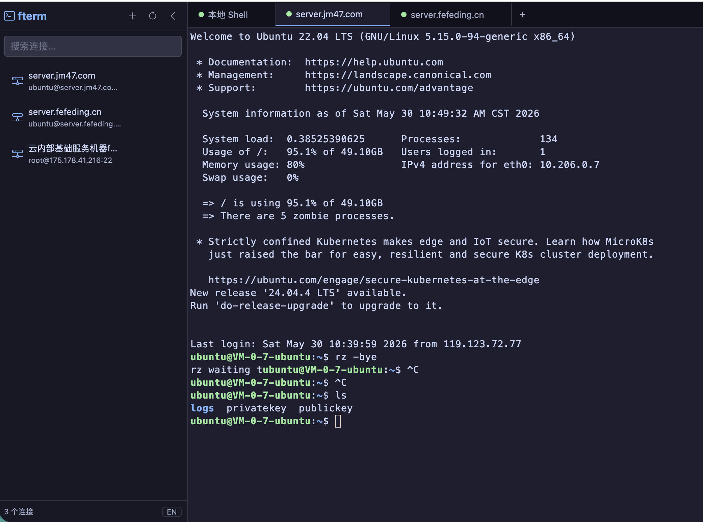

# AICmd

**[English](./README.md)**

一款 AI 驱动的 Web SSH 终端，将全功能终端模拟器与自主 AI Agent 相结合。AI 能理解你的系统环境，自动执行命令、分析日志、管理服务 — 一切通过自然语言对话完成。

## 功能特性

### AI Agent
- **自主操作**：AI Agent 通过工具调用（OpenAI function calling 协议）直接在终端中执行命令。它观察输出、做出决策并迭代直到任务完成。
- **系统感知**：首次连接时自动检测操作系统、CPU、内存、磁盘、已安装服务和可用语言。AI 始终了解它在什么系统上工作。
- **脚本生成**：对于复杂的多步任务，Agent 会生成并执行脚本（Bash/Python/PowerShell），而不是逐条运行命令。
- **跨平台智能**：根据目标操作系统自适应命令 — Linux 用 `systemctl`，macOS 用 `launchctl`，Windows 用 `Get-Service`。

### Skills 技能系统
- **内置技能**：预配置的常用任务操作手册：
  - 服务器健康检查 — 全面的系统指标采集
  - 日志分析 — 使用 Python/awk 脚本进行错误模式检测
  - Docker 管理 — 容器生命周期操作
- **自定义技能**：在 `~/.aicmd/skills/` 目录下创建 Markdown 格式的技能文件。技能可定义领域 SOP、项目专有知识或 LLM 不熟知的任何工作流。
- **斜杠命令**：在聊天输入中使用 `/skill-name` 触发技能。

### 命令审计与回放
- **完整审计轨迹**：AI Agent 执行的每条命令都会自动记录时间戳、会话、命令、输出、耗时和状态（成功/失败/拦截/改写）。
- **时间线视图**：按日期浏览审计日志，支持关键词搜索和状态过滤。
- **统计概览**：总命令数、成功/失败/拦截数量一目了然。
- **导出**：支持导出 JSON 或 CSV 格式，满足合规和事故审查需求。
- **实时更新**：新的审计条目通过 WebSocket 即时出现在审计面板中。
- **自动清理**：超过 30 天的日志自动清除。

### 实时日志监控 + AI 异常检测
- **一键 Tail**：监控远程 SSH 服务器或本机的任意日志文件（`tail -f`）。
- **模式检测**：自动检测 ERROR、FATAL、CRITICAL、Exception、Traceback 等异常模式。
- **告警系统**：分类告警（严重/错误/警告），带时间戳和高亮日志行。
- **AI 分析**：将最近的日志行发送给 AI Agent 进行智能异常分析和建议。
- **彩色输出**：错误行红色、警告行黄色、调试行灰色 — 易于快速扫描。

### 批量操作（多服务器）
- **并行执行**：选择多个活跃 SSH 会话，同时执行相同命令。
- **汇总结果**：查看每台服务器的结果，包含成功/失败状态、输出和执行时间。
- **服务器选择器**：多选 UI，支持全选/取消全选，显示会话名称和连接类型。
- **可展开详情**：点击任意结果查看完整命令输出，支持一键复制。
- **任务历史**：最近的批量任务会被保存以供回顾。

### 终端
- **SSH 远程终端**：基于 xterm.js + ssh2 的完整 SSH 客户端，支持 256 色。
- **本地 Shell**：通过 node-pty 提供原生本地 Shell（macOS/Linux 上为 Bash/Zsh，Windows 上为 PowerShell）。
- **文件传输**：rz/sz（ZMODEM）文件上传和下载，自动处理二进制文件。
- **多会话**：基于标签页的多会话管理，重启后状态持久化。
- **自动重连**：一键重连断开的 SSH 会话。
- **会话持久化**：所有会话和聊天历史均在服务端持久化。

### 通用
- **连接管理**：可视化 SSH 连接配置（增删改查），支持密钥和密码认证。
- **国际化**：中文 / 英文 UI，运行时语言切换。
- **桌面应用**：通过 NW.js 提供跨平台桌面客户端。
- **聊天历史**：持久化 AI 对话历史，支持跨会话浏览和恢复。

## 截图



## 技术栈

| 层级 | 技术 |
|------|------|
| 前端 | Vue 3 + TypeScript + Vite + Bootstrap 5 + xterm.js |
| 后端 | Node.js + Express + WebSocket (ws) |
| SSH/PTY | ssh2 + node-pty |
| AI | OpenAI 兼容 API（支持任意兼容端点） |
| 构建 | Vite + TypeScript + nw-builder |

## 快速开始

### 安装

```bash
npm install -g @fefeding/aicmd
# 或
pnpm add -g @fefeding/aicmd
```

### 环境要求

- Node.js >= 18

### 启动服务

```bash
# 启动（默认端口 9802，自动寻找可用端口）
aicmd start

# 自定义端口
aicmd start --port 3000

# 停止 / 重启
aicmd stop
aicmd restart

# 版本
aicmd -v
```

然后在浏览器中打开 http://localhost:9802。

### 配置 AI

1. 点击左下角侧边栏的机器人图标，或 AI 聊天头部的齿轮图标。
2. 输入 API Key 和基础 URL（支持 OpenAI、DeepSeek、通义千问或任何兼容 API）。
3. 选择模型（默认：`gpt-4o-mini`）。
4. 保存并开始对话。

### 开发模式

```bash
# 克隆并安装
git clone <repo-url>
pnpm install

# 开发模式（热重载）
pnpm dev
# 访问 http://localhost:9801

# 构建
pnpm build          # 前端 + 服务端
pnpm build-server   # 仅服务端

# 启动生产模式
node server.js --port 3000
```

### 桌面应用（NW.js）

```bash
pnpm nw:dev          # 开发模式
pnpm nw:build        # 当前平台
pnpm nw:build:win    # Windows
pnpm nw:build:osx    # macOS
pnpm nw:build:linux  # Linux
```

## AI 使用示例

### 自然语言操作
```
你: 检查 nginx 是否在运行，并显示最近的错误日志
AI: [执行 systemctl status nginx，然后读取错误日志，提供分析]

你: 找出内存占用最多的前 5 个进程
AI: [生成并运行 ps/sort 脚本，以表格形式展示结果]

你: 清理 7 天前的 Docker 镜像
AI: [运行 docker system prune 加过滤条件，报告释放的空间]
```

### 使用技能
```
你: /server-health-check
AI: [生成全面的健康检查脚本，执行它，分析所有指标]

你: /log-analyze /var/log/nginx/error.log
AI: [创建 Python 分析脚本，显示错误分布和模式]
```

### AI 日志分析
```
你: [切换到 Monitor 标签，输入 /var/log/nginx/error.log，点击开始]
AI: [实时日志流，异常检测]
    [告警: CRITICAL - OutOfMemoryError 于 14:23:05 检测]
    [点击 AI 分析 → AI 汇总错误模式并给出修复建议]
```

### 批量操作
```
[点击侧边栏的服务器机架图标 → 选择 5 台服务器]
命令: systemctl status nginx
→ 5 台服务器同时返回状态输出
→ 失败的服务器以红色高亮显示并附带错误详情
```

### 自定义技能

创建 `~/.aicmd/skills/my-deploy.md`：
```markdown
---
name: 部署我的应用
description: 零停机部署生产应用
tags: [deploy, ops]
---

部署步骤：
1. 从 git 拉取最新代码
2. 运行数据库迁移
3. 构建静态资源
4. 使用 PM2 重启（平滑重载）
...
```

然后在聊天中使用 `/deploy-my-app` 触发。

## 项目结构

```
.
├── bin/              # CLI 入口（aicmd 命令）
├── data/skills/      # 内置 AI 技能
├── dist/             # 构建输出
├── public/           # 静态资源
├── scripts/          # 构建脚本（NW.js）
├── server/           # 服务端源码（TypeScript）
│   ├── model/        # 实体定义
│   ├── service/      # 业务逻辑（AI、SSH、Skills、Audit、Monitor、Batch）
│   └── index.ts      # 服务端入口
├── src/              # 前端源码（Vue 3）
│   ├── components/   # Vue 组件
│   │   ├── ai-chat/  # AI 聊天面板（Chat / Audit / Monitor 标签）
│   │   ├── ai-settings/ # AI 配置弹窗
│   │   ├── audit-panel/ # 命令审计时间线
│   │   ├── log-monitor/ # 实时日志监控
│   │   ├── batch-panel/ # 多服务器批量操作
│   │   └── ...       # 终端、侧边栏等
│   ├── locales/      # i18n 翻译
│   ├── service/      # 前端 API 服务
│   ├── stores/       # Pinia 状态管理
│   └── views/        # 页面视图
├── view/             # HTML 模板
└── server.js         # 生产启动
```

## 数据存储

所有数据均存储在服务端本地：

| 数据 | 路径 |
|------|------|
| 连接配置 | `~/.aicmd/connections.json` |
| 会话 | `~/.aicmd/sessions.json` |
| AI 配置 | `~/.aicmd/ai-config.json` |
| 聊天历史 | `~/.aicmd/ai-history/` |
| 审计日志 | `~/.aicmd/audit/YYYY-MM-DD.jsonl` |
| 用户技能 | `~/.aicmd/skills/*.md` |
| 回收站 | `~/.aicmd/.trash/` |

使用 `AICMD_DATA_DIR` 环境变量可覆盖数据目录。

## 安全机制

AI Agent 内置了命令级安全防护，降低破坏性操作的风险：

### 删除保护（回收站）
- 所有 `rm` 命令（Linux/macOS）自动改写为 `mv` 到 `~/.aicmd/.trash/`，而非永久删除。
- Windows 的 `Remove-Item`/`del`/`rd` 命令同样改写为 `Move-Item` 到 `%USERPROFILE%\.aicmd\.trash\`。
- 回收站文件带时间戳（如 `_del_1716000000_filename`）避免命名冲突。
- 恢复文件只需浏览回收站目录并移回原位。

### 危险操作拦截
以下不可逆的破坏性操作会被完全阻止：

| 平台 | 被阻止的操作 |
|------|-------------|
| Linux/macOS | `rm -rf /`、`mkfs.*`（磁盘格式化）、`dd of=/dev/sd*`（磁盘覆写）、fork 炸弹 |
| Windows | `format C:`、`Clear-Disk`、`Remove-Item C:\`、`rd /s C:\` |

### 平台感知
安全层自动检测目标会话的操作系统（通过 systemContext）并应用对应的 Unix 或 Windows 规则 — 无需手动配置。

## 跨平台支持

终端和 AI Agent 可在以下平台工作：

| 平台 | Shell | AI 脚本 |
|------|-------|---------|
| Linux | bash/zsh | Bash + Python + Node.js |
| macOS | zsh/bash | Bash + Python + Node.js |
| Windows | PowerShell 7+/5.x | PowerShell + Python + Node.js |

AI Agent 自动检测目标操作系统并选择合适的命令。

## 许可证

MIT
