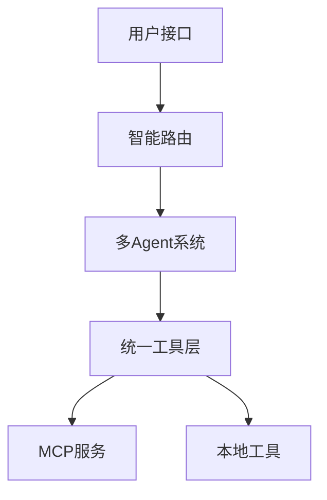
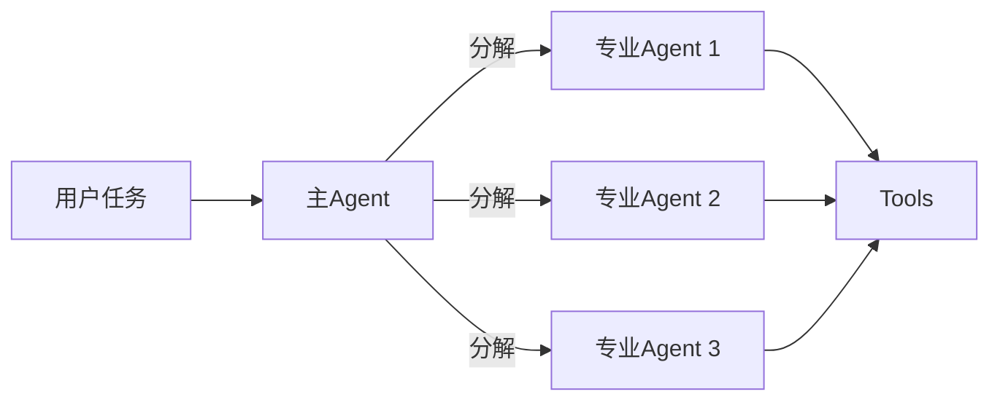
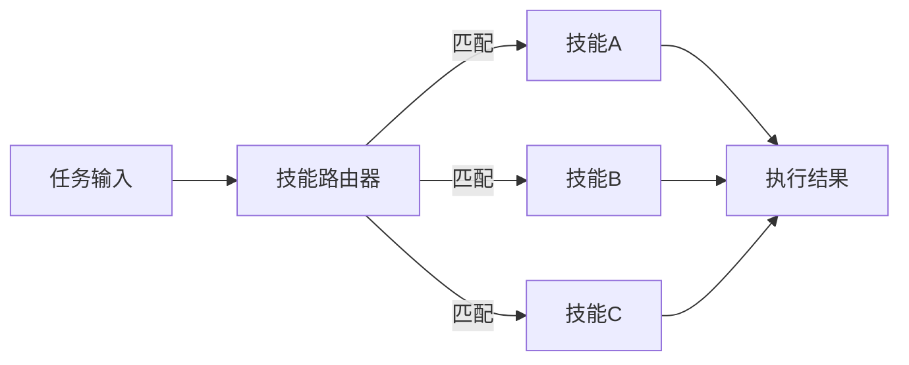
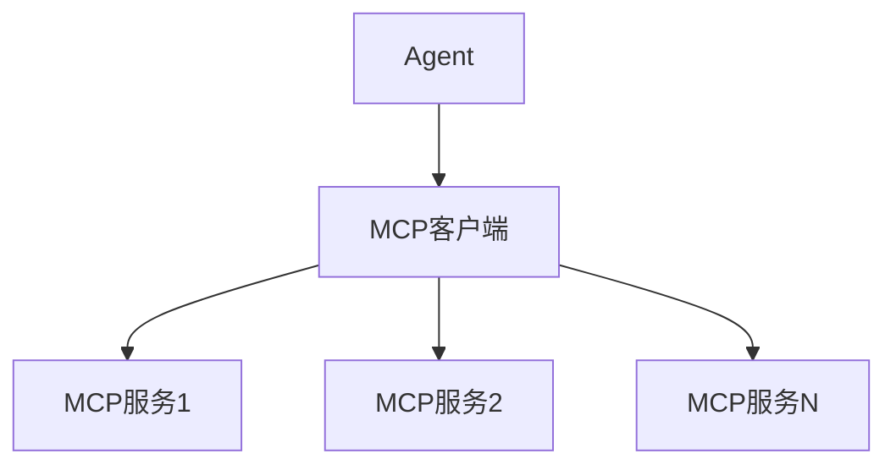

# Agent CLI 架构设计文档

## 1. 核心设计理念

Agent CLI 是一个轻量级但功能强大的命令行智能代理框架，专注于**多Agent协作**、**技能路由**、**工具注入**和**MCP集成**四大核心能力。设计原则：简单、灵活、可扩展。

## 2. 核心架构

### 2.1 整体架构



**三层核心架构：**
- **路由层**：智能分发任务到合适的Agent或Skill
- **Agent层**：多Agent协作执行复杂任务
- **工具层**：统一管理本地工具和MCP服务

### 2.2 多Agent协作模式



**协作特点：**
- 主Agent负责任务分解和结果整合
- 专业Agent专注特定领域（编码、研究、分析等）
- 所有Agent共享统一的工具层

## 3. 关键能力详解

### 3.1 Skills路由系统

**核心思想：** 让Agent能够自动选择和加载最适合的技能



**路由策略：**
- **关键词匹配**：基于任务描述中的关键词
- **LLM智能分析**：让大模型决定最佳技能
- **规则引擎**：预定义的业务规则路由

### 3.2 工具注入机制

**统一工具接口：**
```typescript
// 所有工具都遵循统一接口
function tool(params: any, context: {agentId: string, userId: string}): Promise<any>
```

**注入方式：**
- **静态注入**：Agent启动时预加载常用工具
- **动态注入**：运行时按需加载特定工具
- **MCP自动发现**：自动发现并集成MCP服务提供的工具

### 3.3 MCP集成方案

**无缝集成MCP服务：**


**MCP优势：**
- 标准化协议，易于集成第三方服务
- 自动工具发现和注册
- 统一的权限和安全控制

## 4. 配置示例

### 4.1 基础配置

```yaml
# agent-cli.yaml
global:
  log_level: info
  max_agents: 5

agents:
  # 主Agent - 负责协调
  primary:
    type: primary
    skills: [orchestration, planning]
  
  # 编码专家Agent
  coder:
    type: specialized
    domain: coding
    skills: [code_gen, debug, test]
    tools: [git, npm, file_system]

tools:
  mcp_enabled: true
  mcp_servers:
    - name: github
      endpoint: http://localhost:8080
```

## 5. 使用场景

### 5.1 典型工作流

```bash
# 1. 启动交互式会话
agent-cli repl

# 2. 执行复杂任务（自动路由到多Agent协作）
> 分析这个项目并修复所有bug，然后部署到测试环境

# 3. 结果：多个Agent协作完成整个流程
```

### 5.2 编程API

```typescript
const cli = new AgentCLI();

// 单行代码触发复杂工作流
const result = await cli.run("重构用户认证模块，添加单元测试");
```

## 6. 设计优势

✅ **简单易用**：命令行优先，降低使用门槛
✅ **灵活路由**：智能任务分发，无需手动指定Agent
✅ **统一工具**：本地工具 + MCP服务统一管理
✅ **可扩展**：轻松添加新Agent、新Skill、新工具
✅ **生产就绪**：内置安全、监控、配置管理

## 7. 未来演进

- **短期**：完善核心路由和MCP集成
- **中期**：支持Agent间对话和辩论模式
- **长期**：构建开放的Agent和Skill生态