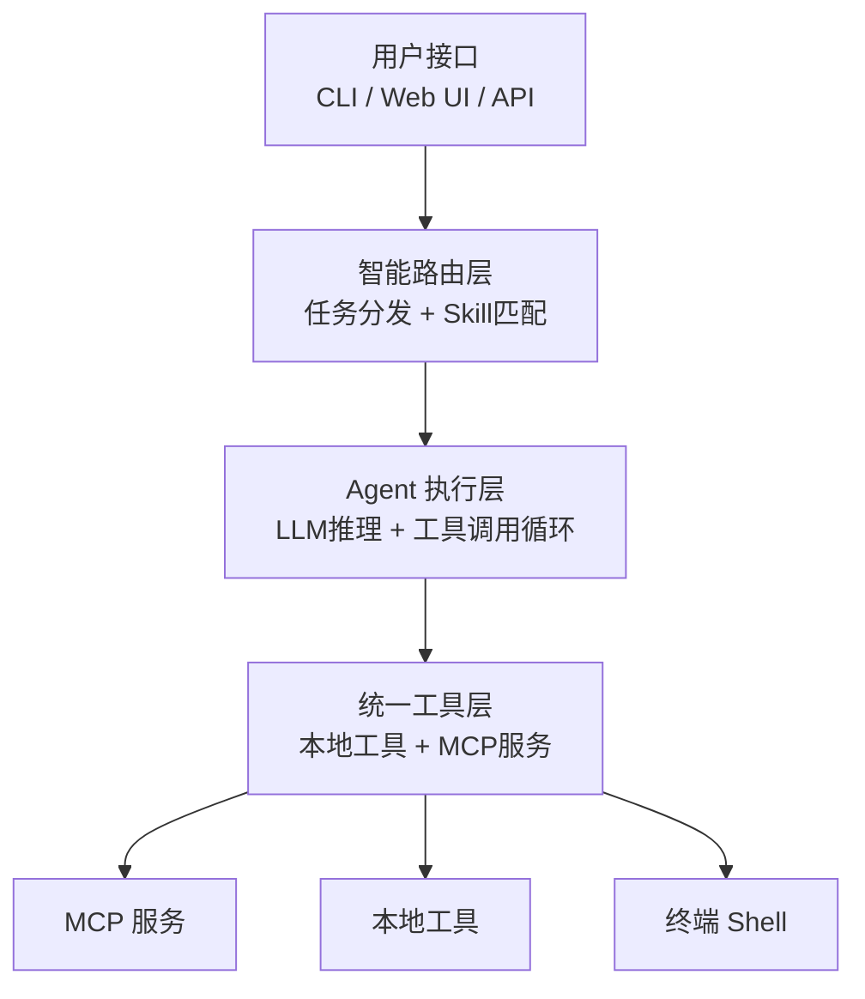
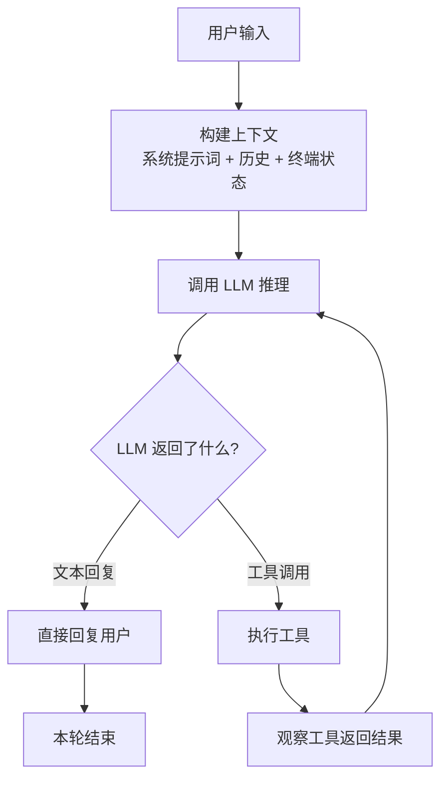
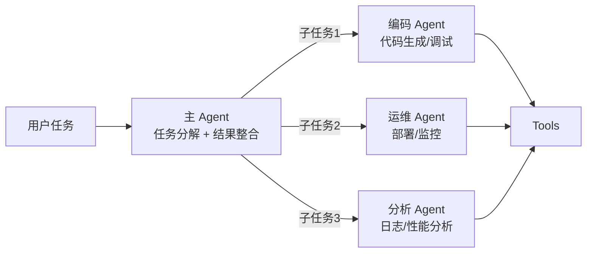
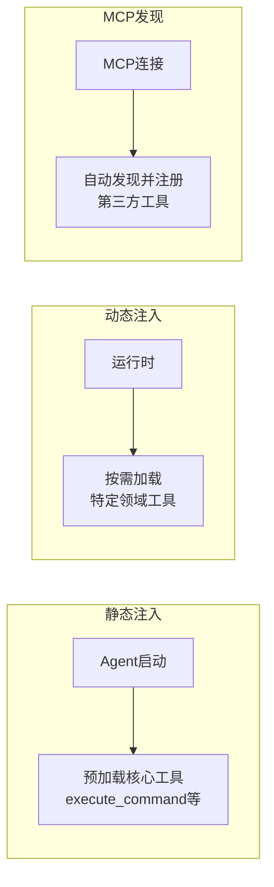
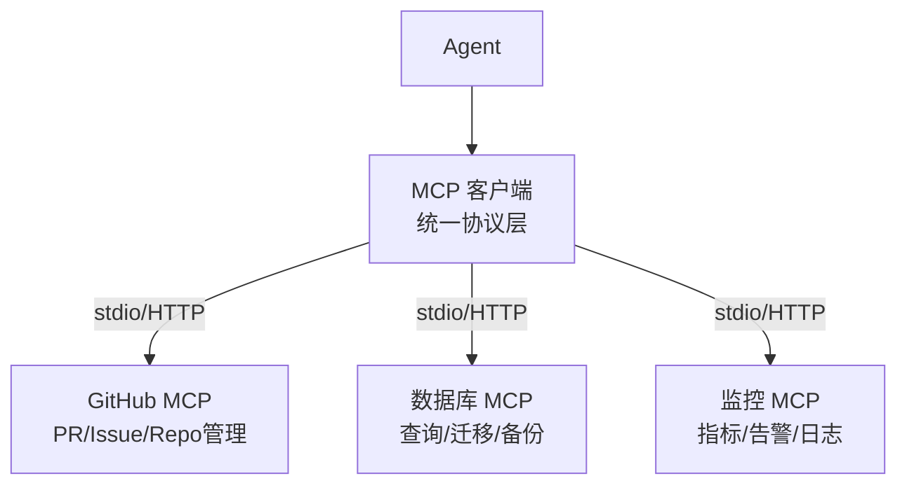
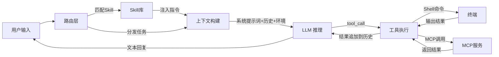

# Agent CLI 架构设计文档

## 1. 核心设计理念

Agent CLI 是一个轻量级但功能强大的命令行智能代理框架，专注于**多Agent协作**、**技能路由**、**工具注入**和**MCP集成**四大核心能力。设计原则：简单、灵活、可扩展。

### 1.1 关键术语解释

| 术语 | 说明 | 类比 |
|------|------|------|
| **Agent** | 一个拥有 LLM 大脑 + 工具手脚的自主执行单元，能感知环境、做出决策、执行动作 | 像一个有经验的运维工程师，能看懂命令输出并决定下一步 |
| **Skill（技能）** | 预定义的任务指令集，以 Markdown 格式描述，告诉 Agent 如何完成某类任务 | 像运维手册/SOP，告诉工程师遇到某类问题该怎么操作 |
| **Tool（工具）** | Agent 可以调用的原子能力，如执行命令、读文件、查日志等 | 像工程师手里的工具箱：终端、编辑器、监控面板 |
| **MCP** | Model Context Protocol，模型上下文协议，一个标准化的工具/资源发现协议 | 像 USB 协议 —— 任何符合协议的工具都能即插即用 |
| **Agent Loop** | Agent 的核心执行循环：思考 → 调用工具 → 观察结果 → 再思考，直到任务完成 | 像工程师的工作方式：看问题 → 执行操作 → 检查结果 → 调整方案 |

### 1.2 为什么需要 Agent CLI？

**传统方式：** 用户手动登录服务器 → 逐条敲命令 → 人肉分析输出 → 手动修复问题

**Agent CLI 方式：** 用户描述目标 → Agent 自动规划步骤 → 自主执行并验证 → 遇到异常自动修复或上报

核心价值：**把「人驱动机器」变成「人描述目标，机器自主完成」**。

## 2. 核心架构

### 2.1 整体架构（三层模型）



**三层架构详解：**

| 层级 | 职责 | 关键组件 | 讲解要点 |
|------|------|---------|----------|
| **路由层** | 接收用户输入，决定由谁来处理 | 技能路由器、Skill 匹配器 | 用户不需要知道该找哪个 Agent，系统自动匹配最合适的技能 |
| **Agent层** | 执行 LLM 推理循环，完成任务 | Agent Loop、上下文管理、消息历史 | 这是系统的"大脑"，负责思考、决策、执行 |
| **工具层** | 提供统一的工具调用接口 | 工具注册表、MCP 客户端、Shell 适配器 | Agent 通过工具与真实环境交互，所有工具遵循统一接口 |

### 2.2 Agent 执行循环（核心机制）

> **这是整个系统最核心的部分，理解了 Agent Loop 就理解了整个架构。**



**Agent Loop 工作流程：**

```
第1轮: 用户说"帮我查看磁盘使用情况"
  → LLM 思考: 需要执行 df -h 命令
  → 调用工具: execute_command({ command: "df -h" })
  → 观察结果: /dev/sda1 使用率 92%
  
第2轮: LLM 继续思考
  → 判断: 92% 偏高，应该找出大文件
  → 调用工具: execute_command({ command: "du -sh /* | sort -rh | head -10" })
  → 观察结果: /var/log 占用 15G
  
第3轮: LLM 继续思考
  → 判断: 日志文件过大，建议清理
  → 回复用户: "磁盘使用率 92%，主要是 /var/log 占用了 15G，建议清理旧日志"
  → 任务完成 ✓
```

**关键设计参数：**
- `MAX_AGENT_ITERATIONS = 15`：单次任务最多执行 15 轮，防止无限循环
- 每轮都有中断检查点，用户可以随时停止 Agent
- 工具执行结果会追加到消息历史，供后续轮次参考

### 2.3 多Agent协作模式



**协作特点：**
- **主Agent（Primary）**：接收用户任务，拆解为子任务，分配给专业 Agent，最终整合结果
- **专业Agent**：专注特定领域，拥有该领域的专业工具和 Skill
- **共享工具层**：所有 Agent 通过统一的工具注册表访问工具，避免重复实现

**适用场景：** "分析这个项目并修复所有 bug，然后部署到测试环境" —— 这类跨领域任务需要多个专业 Agent 协作完成。

## 3. 关键能力详解

### 3.1 Skills 技能系统

> **Skill = Agent 的"操作手册"。** 它让 Agent 不需要每次从零开始思考，而是遵循预定义的最佳实践。

**Skill 的本质：** 一个 Markdown 文件，包含任务描述、执行步骤、注意事项等，会被注入到 Agent 的系统提示词中。

**Skill 定义格式：**
```markdown
---
name: Docker 容器管理
description: 管理和操作 Docker 容器、镜像、网络等
tags: [docker, container, devops]
---

## 任务说明
你将帮助用户管理 Docker 环境...

## 操作流程
1. 先检查 Docker 服务状态
2. 列出当前容器和镜像
3. 根据用户需求执行操作
...

## 注意事项
- 删除容器前确认用户已知晓
- 生产环境操作需要额外确认
```

**Skill 来源与优先级：**
```
系统内置 Skills: <project>/data/skills/*.md  （如 docker-manage.md, log-analyze.md）
用户自定义 Skills: ~/.aicmd/skills/*.md       （用户可根据自己环境定制）
```
用户自定义 Skills 优先级高于系统内置，允许用户覆盖默认行为。

**路由策略（如何自动选择合适的 Skill）：**

| 策略 | 工作方式 | 适用场景 |
|------|---------|----------|
| **显式调用** | 用户通过 `/skill-name` 直接指定 | 用户明确知道需要哪个技能 |
| **关键词匹配** | 基于任务描述中的关键词与 Skill 的 tags 匹配 | 简单场景，如提到"docker"就匹配 docker 技能 |
| **LLM 智能分析** | 让大模型阅读所有 Skill 描述后决定最佳技能 | 复杂场景，需要理解任务意图 |

### 3.2 工具注入机制

> **工具 = Agent 的"手和脚"。** 没有工具的 Agent 只能聊天，有了工具才能真正做事。

**统一工具接口：**
```typescript
// 每个工具注册时提供：名称、描述（给 LLM 看）、参数定义、执行函数
interface ToolDefinition {
  type: 'function';
  function: {
    name: string;           // 工具名称，如 'execute_command'
    description: string;    // 功能描述，LLM 据此决定何时调用
    parameters: object;     // JSON Schema 参数定义
  };
}

// 执行时的统一签名
function execute(params: any, context: AgentContext): Promise<ToolResult>
```

**内置核心工具：**

| 工具名 | 功能 | 说明 |
|--------|------|------|
| `execute_command` | 在终端执行命令 | Agent 的核心能力，支持超时控制 |
| `read_terminal` | 读取终端当前输出 | 让 Agent 感知终端当前状态 |
| `write_file` | 创建/写入文件 | 用于生成脚本、配置文件等 |
| `read_file` | 读取文件内容 | 用于分析日志、配置等 |

**三种注入方式：**



- **静态注入**：Agent 启动时加载核心工具（execute_command、read_terminal 等），始终可用
- **动态注入**：根据当前 Skill 或任务类型，运行时加载特定工具（如数据库工具、K8s 工具）
- **MCP 自动发现**：连接 MCP 服务后，自动发现并注册服务提供的所有工具

### 3.3 MCP 集成方案

> **MCP（Model Context Protocol）** 是一个开放标准，让 AI 模型能以统一方式发现和调用外部工具/资源。可以类比为"AI 世界的 USB 接口"。

**为什么需要 MCP？**
- 没有 MCP：每个外部服务都需要单独写适配代码，N 个服务 × M 个 Agent = N×M 种适配
- 有了 MCP：所有服务遵循统一协议，N 个服务 + M 个 Agent 只需 N+M 种实现



**集成流程：**
1. **连接**：Agent 启动时连接配置的 MCP 服务（通过 stdio 或 HTTP）
2. **发现**：MCP 服务返回其提供的所有工具列表（名称、描述、参数）
3. **注册**：自动将发现的工具注册到 Agent 的工具表中
4. **调用**：Agent 像调用本地工具一样调用 MCP 工具，协议层自动处理通信

**MCP 配置示例：**
```yaml
tools:
  mcp_enabled: true
  mcp_servers:
    - name: github
      transport: stdio          # 通过 stdio 连接本地 MCP 进程
      command: npx @mcp/github
      env:
        GITHUB_TOKEN: xxx
    - name: database
      transport: http           # 通过 HTTP 连接远程 MCP 服务
      endpoint: http://localhost:8080
```

## 4. 安全机制

> **Agent 能直接操作终端，安全是重中之重。**

| 机制 | 说明 | 示例 |
|------|------|------|
| **删除保护** | rm 命令自动将文件移入回收站而非永久删除 | `rm file.txt` → 移动到 `~/.aicmd/.trash/` |
| **危险操作拦截** | 极端破坏性命令直接阻止执行 | `rm -rf /`、`mkfs` 等 |
| **迭代上限** | 单次任务最多 15 轮迭代，防止失控 | Agent 不会无限执行下去 |
| **用户中断** | 每轮迭代前检查中断标志，用户可随时停止 | 点击"停止"按钮立即中止 |
| **风险提示** | 对格式化、覆写等危险操作，先说明风险让用户确认 | Agent 会先警告再操作 |

## 5. 上下文管理

> **上下文 = Agent 的"记忆"和"感知"。** 上下文质量直接决定 Agent 决策质量。

**上下文组成：**
```
┌─────────────────────────────────────────┐
│  系统提示词（Agent 的身份和能力定义）       │
│  + 系统环境信息（OS、CPU、内存、磁盘...）   │  ← 自动采集，让 Agent 知道在哪台机器上
│  + Skill 指令（如果选择了技能）             │  ← 按需注入
│  + 终端当前输出（最近 50 行）              │  ← 让 Agent 感知终端状态
│  + 对话历史（最多 50 条消息）              │  ← 保持对话连贯性
│  + 用户当前输入                            │
└─────────────────────────────────────────┘
```

**关键设计：**
- **MAX_MESSAGES = 50**：限制历史消息数量，避免超出 LLM 上下文窗口
- **MAX_HISTORY_AGE = 24h**：超过 24 小时的历史自动清理
- **系统环境自动采集**：首次对话时自动检测 OS 类型、CPU、内存、磁盘等信息，注入系统提示词

## 6. 配置示例

### 6.1 基础配置

```yaml
# agent-cli.yaml
global:
  log_level: info
  max_agents: 5

agents:
  # 主Agent - 负责协调
  primary:
    type: primary
    skills: [orchestration, planning]
  
  # 编码专家Agent
  coder:
    type: specialized
    domain: coding
    skills: [code_gen, debug, test]
    tools: [git, npm, file_system]

  # 运维专家Agent
  ops:
    type: specialized
    domain: operations
    skills: [docker-manage, log-analyze, server-health-check]
    tools: [ssh, docker, kubectl]

tools:
  mcp_enabled: true
  mcp_servers:
    - name: github
      transport: stdio
      command: npx @mcp/github
```

### 6.2 自定义 Skill 示例

```markdown
---
name: 服务器健康检查
description: 定期检查服务器健康状态并生成报告
tags: [server, health, monitoring, ops]
---

## 检查清单
1. CPU 和内存使用率（top/free）
2. 磁盘使用率（df -h）
3. 网络连通性（ping 测试）
4. 关键服务状态（systemctl）
5. 最近异常日志（journalctl --since today -p err）

## 输出格式
生成结构化的健康报告，标注异常项并给出建议。
```

## 7. 使用场景

### 7.1 典型工作流

```bash
# 1. 启动交互式会话
agent-cli repl

# 2. 简单任务（单 Agent 直接完成）
> 查看当前目录结构

# 3. 中等任务（Agent 多轮迭代完成）
> 分析 /var/log/nginx/access.log 中最近 1 小时的异常请求

# 4. 复杂任务（多 Agent 协作完成）
> 分析这个项目并修复所有 bug，然后部署到测试环境

# 5. 使用 Skill（预定义流程）
> /server-health-check 检查生产服务器状态
```

### 7.2 编程API

```typescript
const cli = new AgentCLI();

// 单行代码触发复杂工作流
const result = await cli.run("重构用户认证模块，添加单元测试");

// 带 Skill 的执行
const result2 = await cli.run("检查服务器状态", { skill: "server-health-check" });

// 流式获取 Agent 执行过程
cli.runStream("分析日志", (event) => {
  if (event.type === 'tool_call') console.log('执行:', event.tool);
  if (event.type === 'message') console.log('回复:', event.content);
});
```

## 8. 数据流全景图

> **把以上所有概念串起来的完整数据流：**



## 9. 设计优势

| 优势 | 说明 |
|------|------|
| **简单易用** | 命令行优先 + Web UI 双入口，降低使用门槛 |
| **灵活路由** | 智能任务分发 + 显式 Skill 调用，无需手动指定 Agent |
| **统一工具** | 本地工具 + MCP 服务统一管理，一套接口适配所有 |
| **可扩展** | 新增 Agent/Skill/Tool 只需添加配置或 Markdown 文件 |
| **安全可控** | 删除保护 + 危险拦截 + 迭代上限 + 用户中断 |
| **跨平台** | 自动检测 OS 类型，生成适配当前平台的命令 |

## 10. 未来演进

| 阶段 | 目标 | 具体内容 |
|------|------|----------|
| **短期** | 夯实核心 | 完善 Agent Loop 稳定性、丰富内置 Skill 库、MCP 集成优化 |
| **中期** | 多 Agent 协作 | Agent 间对话和辩论模式、任务依赖图、并行执行 |
| **长期** | 生态建设 | 开放 Skill/Tool 市场、社区贡献、插件生态 |